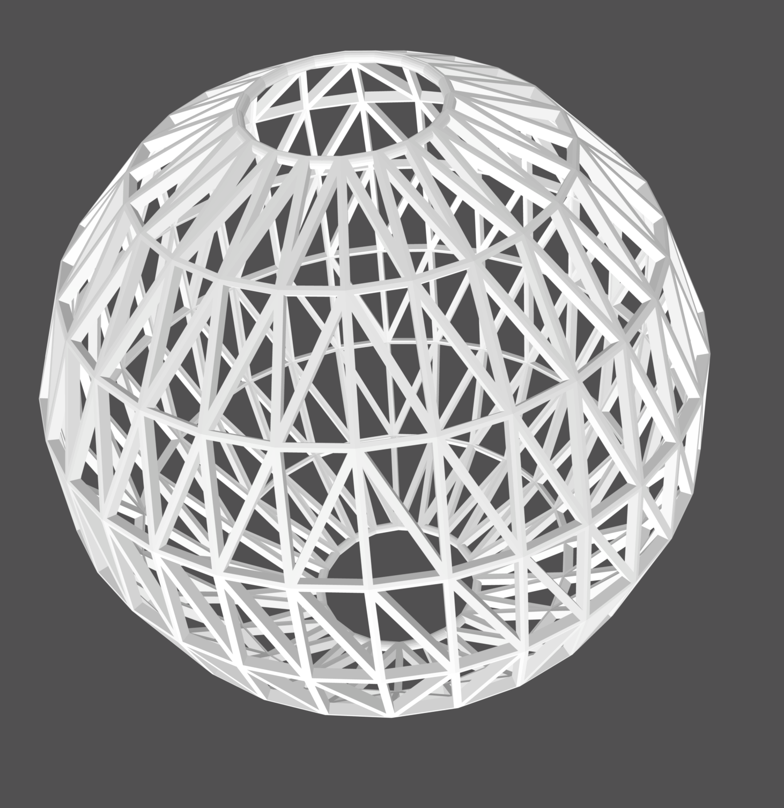
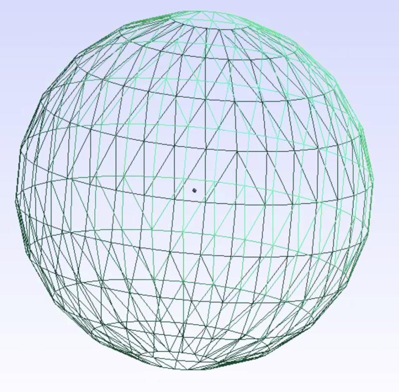
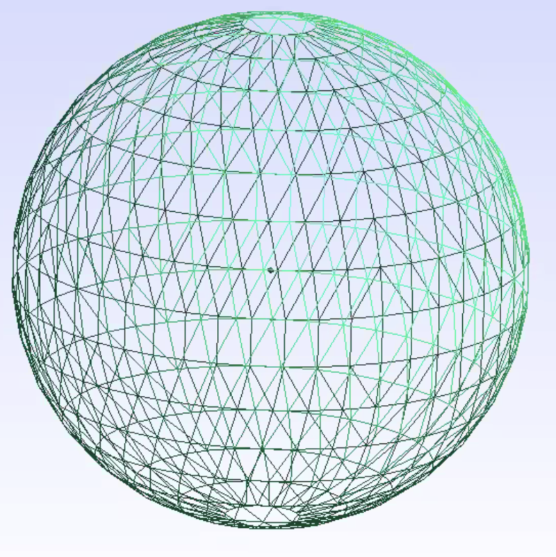
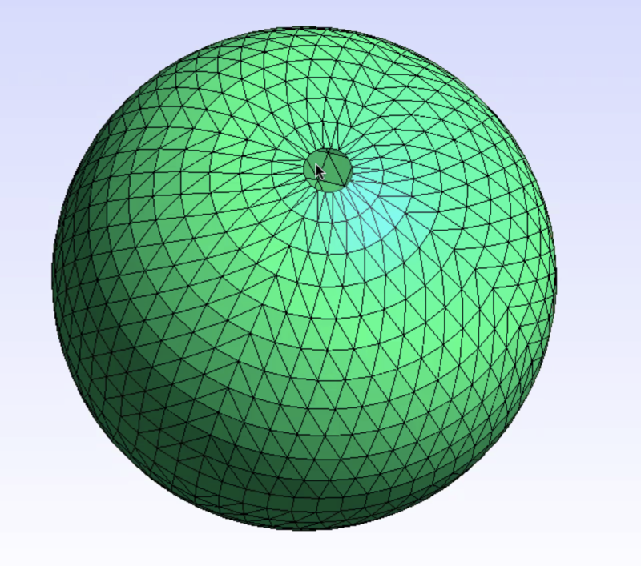
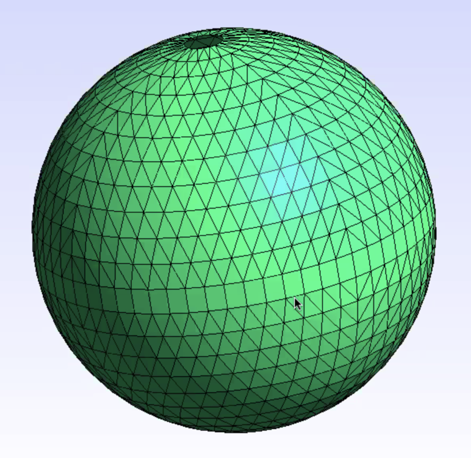
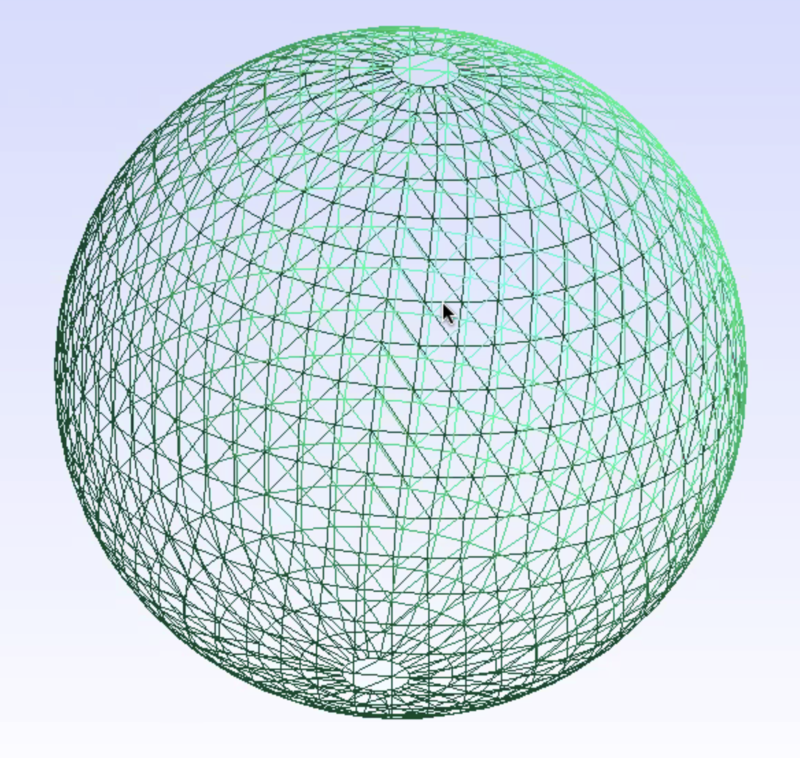

## Octahedral Gaussian

Octahedral Gaussian grid.

### Source
Grid data prepared by Christian Kuehnlein (ECMWF)

The source used is the mesh_04.msh. The "04" refers to 4 parallels between the equator and the pole. The msh data for "05" is also available. Below images with 5, 8 and 12 parallels. Computational models use nearly 8 000 parallels (about 1 km resolution).

Final file octahedral-gaussian.stl prepared by Oliver Labs.

### Other Images

